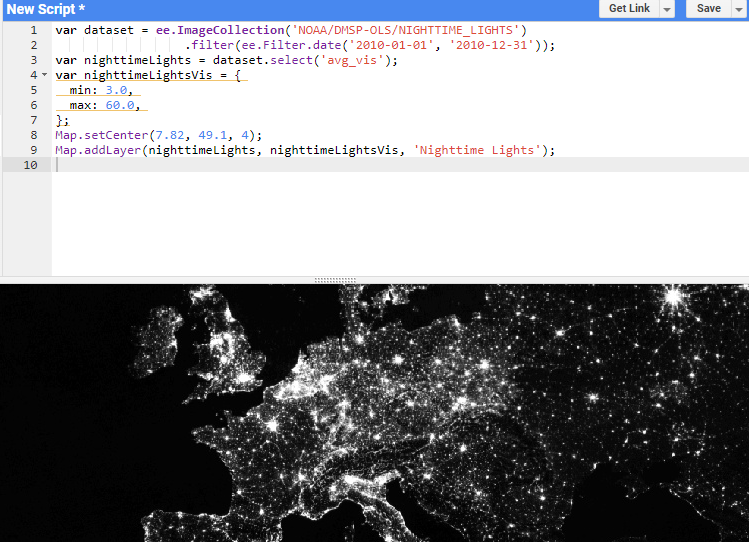

```{r setup, include = FALSE}
library(knitr)                              # paquete que trae funciones utiles para R Markdown
library(tidyverse)                          # paquete que trae varios paquetes comunes en el tidyverse
library(datos)                              # paquete que viene con datos populares traducidos al español :)
library(icons)                               # paquete para iconsos
library(emo)                                # paquete para emojis
library(reticulate)
library(rgee)
library(geojsonio)
# opciones predeterminadas
knitr::opts_chunk$set(echo = FALSE,         # FALSE: los bloques de código NO se muestran
                      dpi = 300,            # asegura gráficos de alta resolución
                      warning = FALSE,      # los mensajes de advertencia NO se muestran
                      error = FALSE)        # los mensajes de error NO se muestran

```

class: left, bottom
background-image: url(https://www.cepal.org/sites/default/files/eclac_logo_es.png)
background-position: 94% 10%
background-size: 15%


# `r rmarkdown::metadata$title`
----
## **`r rmarkdown::metadata$subtitle`**
### `r rmarkdown::metadata$author`
### `r rmarkdown::metadata$date`

---
name: hola
class: inverse, middle, center


# Obtención de información de imagenes satelitales 

## Uso de Google Earth Engine

[`r fontawesome("paper-plane")` jfzeac@gmail.com](https://jfzeac@gmail.com/)<br/>
[`r fontawesome("twitter")` @josefernandozea](https://twitter.com/josefernandozea)<br/>

Documento para extraer información de imágenes satalitales para su uso en procesos de estimación de áreas pequeñas


---
class: inverse, middle

# Contenido

----

.pull-left[

.left[
1. [Uso de imágenes satalitales y SAE](#listas)

2. [Imágenes Raster](#tablas-citas)

3. [Google Earth Engine](#resaltando-lineas)

4. [Instalación de Python y GEE](#adios)
]

]<!--end of left-column-->

.pull-right[

.left[
5. [Consultas en GEE](#listas)

6. [Cruces con Shape Files](#tablas-citas)

7. [Ejemplo](#resaltando-lineas)

8. [Conclusiones](#adios)
]

] <!--end of right-column-->

---

# Uso de imágenes satalitales y SAE

Uno de los artículo pioneros de estimación de áreas pequeñas fue el artículo de Singh, R, et. al. (2002) el cual abordó la estimación del rendimiento de cultivos para los tehsil (unidad subadministrativa)  del distriyo Rohtak district en Haryana (India). 

```{r echo=FALSE, out.width = "500px", out.height="250px",fig.align='center'}

```


.footnote[
----
SAE: https://www.unfpa.org/sites/default/files/pub-pdf/19-310_SAE_Brochure_A4-SINGLE-PROOF6.pdf
]


---

.left-column[

# Imágenes raster
]

Las imagénes raster representan el mundo mediante un conjunto de celdas contiguas igualmente espaciadas conocidas como pixeles, estas imágenes tienen información como un sistema de información geográfico, Un sistema de referencia de coordenadas. Las imágenes almacenan un identificador, un valor en cada pixel (o un vector con diferentes valores) y cada celda tiene asociada una escala de colores.

Las imágenes pueden obtenerse crudas y procesadas, estas primeras contienen solamente las capas de colores, las segundas contienen también valores que han sido procesados en cada celda (índices de vegetación, intensidad lumínica, tipo de vegetación). 

La información cruda puede utilizarse para entrenar características que se desean entrenar (carreteras, tipo de cultivo, bosque / no bosque), afortunadamente en Google Earth Engine encontramos muchos indicadores  procesadas asociadas a un pixel. Estos indicadores pueden agregarse a nivel de un área geográfica.


---
name: listas
# Fuentes de datos de imágenes satelitales

--

Algunas de las principales fuentes de imágenes satalitales son: 

--

* http://earthexplorer.usgs.gov/

--

* https://lpdaacsvc.cr.usgs.gov/appeears/

--

* https://search.earthdata.nasa.gov/search

--

* https://scihub.copernicus.eu/

--

* https://aws.amazon.com/public-data-sets/landsat/

--

-----

Sin embargo la mayor parte de estas fuentes están centralizadas en **Google Earth Engine** que permite buscar fuentes de datos provenientes de imágenes satelitales. GEE se puede manejar porm medio de APIS en diferentes lenguajes de programación: Javascript (por defecto), Python y R (paquete rgee).


---

.left-column[

# Google Earth Eninge
]


Crear una cuenta en [link](earthengine.google.com), una vez que se ingrese a la cuenta puede buscarse los conjuntos de datos de interés:


```{r echo=FALSE, out.width = "500px", out.height="250px",fig.align='center'}
knitr::include_graphics("lights.png")
```


* Una vez se busque el conjunto de datos se puede abrir un editor de código brindado por google en  Javascript. 

*  Copiar y pegar la sintaxis que brinda el buscador de conjunto de datos para visualizar la imagen raster y disponer de sentencias que permitan la obtención  del conjunto de datos de interés posteriormente en R

```{r echo=FALSE, out.width = "500px", out.height="250px",fig.align='center'}

```


---
# Instalación de rgee

*  Descargar e instalar anaconda o conda. (<https://www.anaconda.com/products/individual>)

*  Abrir Anaconda prompt y configurar ambiente de trabajo (ambiente python rgee_py) con las siguientes sentencias:

````markdown
`r ''````{r}
conda create -n rgee_py python=3.9
activate rgee_py
pip install google-api-python-client
pip install earthengine-api
pip install numpy
```
````

*  Listar los ambientes de Python disponibles en anaconda prompt

````markdown
`r ''````{r}
conda env list
```
````

---

*  Una vez identificado la ruta del ambiente ambiente rgee_py definirla en R (no se debe olvidar cambiar \\ por /). Instalar reticulate y rgee, cargar paquetes para procesamiento espacial y configurar el ambiente de trabajo como sigue:

````markdown
`r ''````{r}
library(reticulate) # Conexión con Python
library(rgee) # Conexión con Google Earth Engine
library(sf) # Paquete para manejar datos geográficos
library(dplyr) # Paquete para procesamiento de datos

rgee_environment_dir = "C://Users//Stats//.conda//envs//rgee_py"

# Configurar python (Algunas veces no es detectado y se debe reiniciar R)
reticulate::use_python(rgee_environment_dir, required=T)

rgee::ee_install_set_pyenv(py_path = rgee_environment_dir, py_env = "rgee_py")

Sys.setenv(RETICULATE_PYTHON = rgee_environment_dir)
Sys.setenv(EARTHENGINE_PYTHON = rgee_environment_dir)
```
````

*  Una vez configurado el ambiente puede iniciarlizarse una sesión de Google Earth Engine como sigue:

````markdown
`r ''````{r}
rgee::ee_Initialize(drive = T)
```
````

---

# Obtención de imágenes satelitales imágenes nocturnas

1.  Se debe inicializar cada sesión con el comando rgee::ee_Initialize(drive = T). Los comandos de javascript que invoquen métodos con "." se sustituyen por signo peso:

````markdown
`r ''````{r}
ee.ImageCollection().filterDate()  # Javascript
ee$ImageCollection()$filterDate()  # R
```
````

Por ejemplo en javascript la setencia que permite filtrar la información del año 2017 es ee.ImageCollection('LANDSAT/LC08/C01/T1_8DAY_EVI').filterDate('2017-01-01', '2017-12-31') En R facilmente se traduce a:

````markdown
`r ''````{r}
dataset <- ee$ImageCollection('LANDSAT/LC08/C01/T1_8DAY_EVI')$filterDate('2017-01-01', '2017-12-31')
ee_print(dataset)
```
````

3.Los cálculos realizados con GEE son ejecutados en la nube.


---

# Ejemplo (luces nocturnas): lectura shapefile

Para extraer datos de cada pixel y agregarlos a nivel de entidades territoriales la forma más sencilla es filtrar con un shapefile:

````markdown
`r ''````{r}
library(dplyr)
colombia <-  st_read("mpio/mpio.shp")
plot(colombia %>% select(MPIOS, geometry))
```
````


```{r}
library(sf)
colombia <-  st_read("mpio/mpio.shp")
```


---

# Ejemplo (luces nocturnas): lectura shapefile

```{r, warning = FALSE, message = FALSE, height = 80, width = 40}
plot(colombia %>% select(MPIOS, geometry))
```

---
# Luces nocturnas: lectura shapefile

Como ya se mención en Google Earth Engine se realiza la busqueda night lights y se adapta la sintaxis de R:


````markdown
`r ''````{r}
night_lights = ee$ImageCollection("NOAA/DMSP-OLS/NIGHTTIME_LIGHTS")
ee_print(night_lights)
```
````

Para obtener una medida de desarrollo, se agregarán a nivel de cada municipio la intensidad de luz, previamente, se seleccionara el año 2013 y la variable avg_vis:


````markdown
`r ''````{r}
night_lights_2014 = ee$ImageCollection("NOAA/DMSP-OLS/NIGHTTIME_LIGHTS") %>%
                    ee$ImageCollection$filterDate("2013-01-01", "2014-01-01") %>% 
                    ee$ImageCollection$map(function(x) x$select("avg_lights_x_pct")) %>% 
                    ee$ImageCollection$toBands() 
ee_print(night_lights_2014)
```
````

---
# Luces nocturnas


```{r, fig.align="center"}
rgee::ee_Initialize(drive = T)
night_lights_2014 = ee$ImageCollection("NOAA/DMSP-OLS/NIGHTTIME_LIGHTS") %>%
                    ee$ImageCollection$filterDate("2013-01-01", "2014-01-01") %>% 
                    ee$ImageCollection$map(function(x) x$select("avg_lights_x_pct")) %>% 
                    ee$ImageCollection$toBands() 
ee_print(night_lights_2014)
```


---
#Luces nocturnas


````markdown
`r ''````{r}
night_lights_2014_col <- ee_extract(x = night_lights_2014, y = colombia['MPIOS'],
                                    ee$Reducer$sum(),
                                    sf = FALSE)
```
````

```{r, warning=FALSE, message=FALSE}
night_lights_2014_col <- ee_extract(x = night_lights_2014, y = colombia['MPIOS'],
                                    ee$Reducer$sum(),
                                    sf = FALSE)
class(night_lights_2014_col)
```

```{r, out.width="50%",  out.height="50%"}
Map$addLayer(eeObject = night_lights_2014, name = 'luces')
```


---
# Integración con covariables


````markdown
`r ''````{r}
df_proxys <- readRDS("df_proxys.rds")
df_proxys <- left_join(df_proxys, night_lights_2014_col, 
                       by = c("cod_mpio" = "MPIOS"))
cor(df_proxys[c("poblacion_2019", "valor_agregado_2016", "num_empresas", "F182013_avg_lights_x_pct")], 
    use = "pairwise.complete.obs")
```
````


```{r}
df_proxys <- readRDS("df_proxys.rds")
df_proxys <- left_join(df_proxys, night_lights_2014_col, 
                       by = c("cod_mpio" = "MPIOS"))
cor(df_proxys[c("poblacion_2019", "valor_agregado_2016", "num_empresas", "F182013_avg_lights_x_pct")], 
    use = "pairwise.complete.obs")
```


---
name: adios
class: middle, inverse

.pull-left[
# **¡Gracias!**
<br/>
## José Fernando Zea  

### CEPAL

#### Bogotá, Colombia 
]

.pull-right[
.right[


[`r fontawesome("twitter")` @josefernandozea](https://twitter.com/josefernandozea)<br/>
[`r fontawesome("paper-plane")` jfzeac@gmail.com](mailto:jfzeac@gmail.com)
]
]

